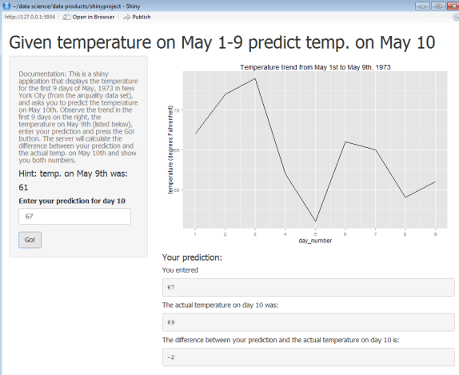

## Introduction

It's well known that the best predictor for the temperature today is the temperature yesterday plus the recent trend in temperatures.

This application provides the temperature on May 9, 1973 in New York City (from R's airquality data set), a graph showing the trend of temperatures from May 1st to 9th, and asks the user to predict the temperature on May 10th.


The graph for the temperature during May 1-9 is generated by the following R code and rendered on the next page:


```{r echo=FALSE }

data(airquality);
library(ggplot2);

```

```{r echo=TRUE }
airquality$day_number <- seq(1,153);

p <- ggplot(airquality[seq(1,9),],aes(x=day_number,y=Temp)) + 
         geom_line() + 
         scale_x_continuous(breaks=seq(1,10)) + 
         ggtitle("Temperature trend from May 1st to May 9th, 1973") +
         ylab("temperature (degrees Fahrenheit)");

```

--- .class #id

## Rendered Graph of Temperature Trend from May 1 to May 9

```{r simple-plot, fig.height=6, fig.align='center', message=FALSE, echo=TRUE}
print(p);
```

--- .class #id

## User Interface

In the user interface shown below the user inputs a prediction and the application shows the difference between the prediction and actual value of the temperature on May 10th.




--- .class #id

## Conclusions

This application displays the temperature trend over the first nine days of May, 1973 in New York City and allows the user to enter his/her prediction for the temperature on May 10th.

The difference between the user's prediction and actual temperature on May 10th is calculated and displayed.